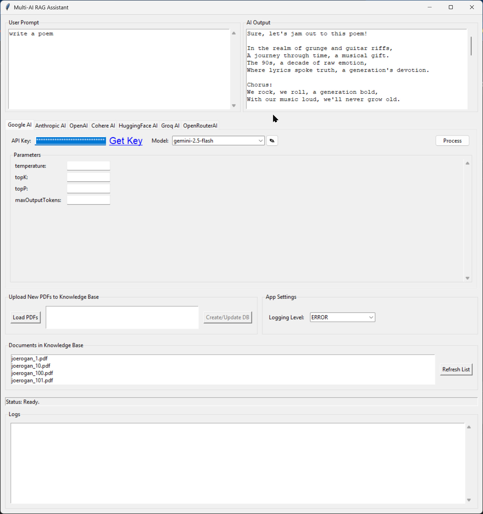

# Multi-AI RAG Assistant

## Overview

This is a Retrieval-Augmented Generation (RAG) application built with Python and Tkinter. It provides a graphical user interface to create a local, searchable knowledge base from PDF documents. Users can then ask questions or submit prompts, which are augmented with relevant information from the knowledge base and sent to one of several supported Large Language Model (LLM) providers for a response.

The entire application, including the necessary embedding model, can be bundled into a single standalone executable for Windows using the provided build script.

## Core Components

1.  **`rag_app.py`**: The main application file containing the Tkinter GUI. It handles PDF loading, FAISS vector store creation, and user interaction.
2.  **`ai_module.py`**: A dedicated module for managing all interactions with external LLM APIs. It supports multiple providers, handles API keys, and formats requests.
3.  **`pre_download_model.py`**: A utility script to download the `sentence-transformers/all-MiniLM-L6-v2` embedding model from Hugging Face. This ensures the model is available locally for the build process.
4.  **`build.bat`**: A Windows batch script that automates the setup and build process. It creates a virtual environment, installs all dependencies, downloads the embedding model, and uses PyInstaller to package everything into a single `.exe` file located in the `dist` folder.

## Features

-   **Local Knowledge Base**: Load multiple PDF files to create a persistent vector database using FAISS.
-   **Multi-Provider AI Support**: Connects to a variety of LLM API providers, including:
    -   Google AI
    -   Anthropic AI
    -   OpenAI
    -   Cohere AI
    -   HuggingFace AI
    -   Groq AI
    -   OpenRouterAI
-   **Configurable AI Parameters**: Adjust settings like model, temperature, max tokens, and top-p for each provider directly in the UI.
-   **Standalone Executable**: The included `build.bat` script packages the application and all its dependencies (including the embedding model) into a single `.exe` file for easy distribution and use on Windows.
-   **Session Persistence**: API keys and model settings are saved locally in a `settings.json` file.

## Setup and Build

To build the application from the source, run the `build.bat` script.

The script will perform the following steps:
1.  Create a Python virtual environment in a `venv` directory.
2.  Activate the environment.
3.  Install all required Python libraries from pip, including a CUDA-enabled version of PyTorch if supported.
4.  Run `pre_download_model.py` to fetch the embedding model and save it to `local_model/`.
5.  Use PyInstaller to compile `rag_app.py` and bundle the downloaded model into `dist/rag_app.exe`.

## Usage

1.  Run the generated `rag_app.exe` from the `dist` folder.
2.  Navigate to the tab for your desired AI provider.
3.  Enter your API key. Keys are saved automatically for future sessions.
4.  Use the "Load PDFs" button to select documents for your knowledge base.
5.  Click "Create/Update DB" to process the PDFs into a FAISS vector store.
6.  Enter your prompt in the "User Prompt" text box.
7.  Click "Process" to send the prompt and retrieved context to the selected AI.
"""
